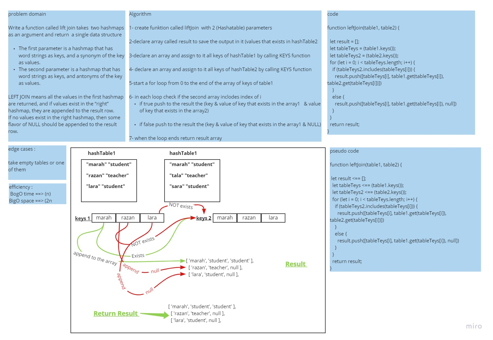

# Challenge Summary
<!-- Description of the challenge -->
Write a function called lift join takes  two hashmaps as an argument and return  a single data structure

The first parameter is a hashmap that has word strings as keys, and a synonym of the key as values.
The second parameter is a hashmap that has word strings as keys, and antonyms of the key as values.

LEFT JOIN means all the values in the first hashmap are returned, and if values exist in the “right” hashmap, they are appended to the result row.
If no values exist in the right hashmap, then some flavor of NULL should be appended to the result row.
## Whiteboard Process
<!-- Embedded whiteboard image -->

## Approach & Efficiency
 What approach did you take? Why? What is the Big O space/time for this approach?
 i used fot loop to loop inside the array of keys  and if statement to check the values 
Time bigO(n)
cpace BigO(2n)
## Solution
<!-- Show how to run your code, and examples of it in action -->
```
function leftJoin(table1, table2) {

  let result = [];
  let tableTeys = (table1.keys());
  let tableTeys2 = (table2.keys());
  for (let i = 0; i < tableTeys.length; i++) {
    if (tableTeys2.includes(tableTeys[i])) {
      result.push([tableTeys[i], table1.get(tableTeys[i]), table2.get(tableTeys[i])])
    }
    else {
      result.push([tableTeys[i], table1.get(tableTeys[i]), null])
    }
  }
  return result;
}