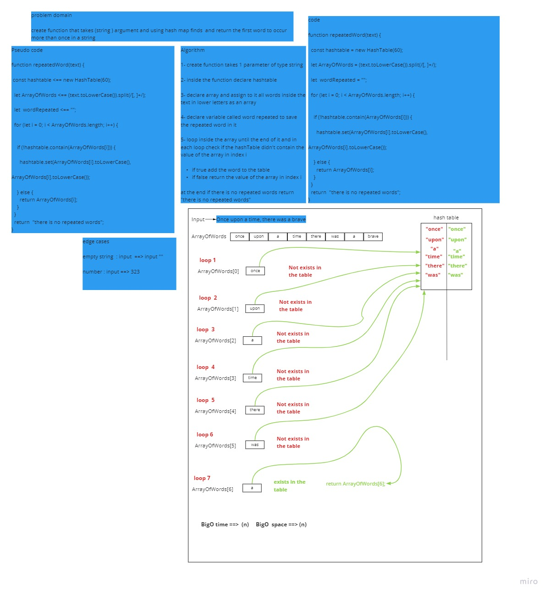

# Challenge Summary
<!-- Description of the challenge -->
create function that takes (string ) argument and using hash map finds  and return the first word to occur more than once in a string
## Whiteboard Process
<!-- Embedded whiteboard image -->

## Approach & Efficiency
 What approach did you take? Why? What is the Big O space/time for this approach?
 i used fot loop to loop inside the array of words  and if statement to check the values 
Time bigO(n)
cpace BigO(n)
## Solution
<!-- Show how to run your code, and examples of it in action -->
```
function repeatedWord(text) {
//console.log(typeof text);
if(typeof text!="string"){return "you didn't send string "}
else{
  const hashtable = new HashTable(60);
  let ArrayOfWords = (text.toLowerCase()).split(/[, ]+/);
  let  wordRepeated = "";
  for (let i = 0; i < ArrayOfWords.length; i++) {

    if (!hashtable.contain(ArrayOfWords[i])) {

      hashtable.set(ArrayOfWords[i].toLowerCase(), ArrayOfWords[i].toLowerCase());
    } else {
      return ArrayOfWords[i];
    }
  }

  return "there is no repeated words";
}
}