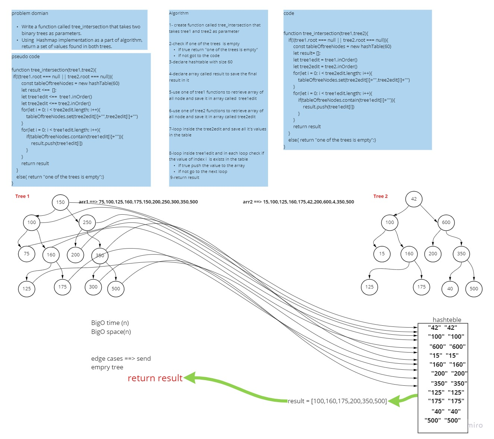

# Challenge Summary
<!-- Description of the challenge -->
Write a function called tree_intersection that takes two binary trees as parameters.
Using  Hashmap implementation as a part of algorithm, return a set of values found in both trees.
## Whiteboard Process
<!-- Embedded whiteboard image -->

## Approach & Efficiency
 What approach did you take? Why? for loop to loop inside the arrays and ifstatement 
 What is the Big O space/time for this approach?  BigO time /space (n)

## Solution
<!-- Show how to run your code, and examples of it in action -->

  ```
  
function tree_intersection(tree1,tree2){
    if(!(tree1.root === null || tree2.root === null)){
        const tableOftreeNodes = new hashTable(60)
        let result= [];
        let tree1edit = tree1.inOrder()
        let tree2edit = tree2.inOrder()
        for(let i = 0; i < tree2edit.length; i++){
            tableOftreeNodes.set(tree2edit[i]+"",tree2edit[i]+"")
        }
        for(let i = 0; i < tree1edit.length; i++){
            if(tableOftreeNodes.contain(tree1edit[i]+"")){
                result.push(tree1edit[i])
            }
        }
        return result
    }
    else{ return "one of the trees is empty";}
}