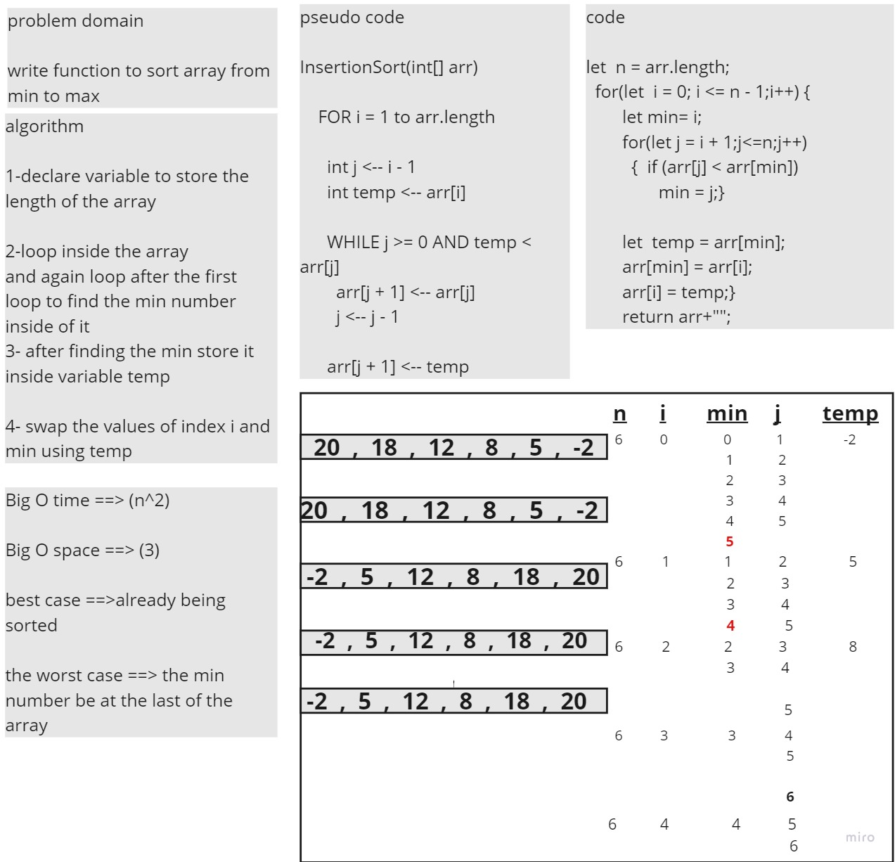

# Challenge Summary
<!-- Description of the challenge -->
write function to sort array from min to max 
## Whiteboard Process
<!-- Embedded whiteboard image -->

## Approach & Efficiency
What approach did you take? Why?  nestead for loop the first for loop is to loop inside the array and the second loop is to find the min 
   What is the Big O space/time for this approach? 
   Big O time ==> (n^2)

Big O space ==> (3)

