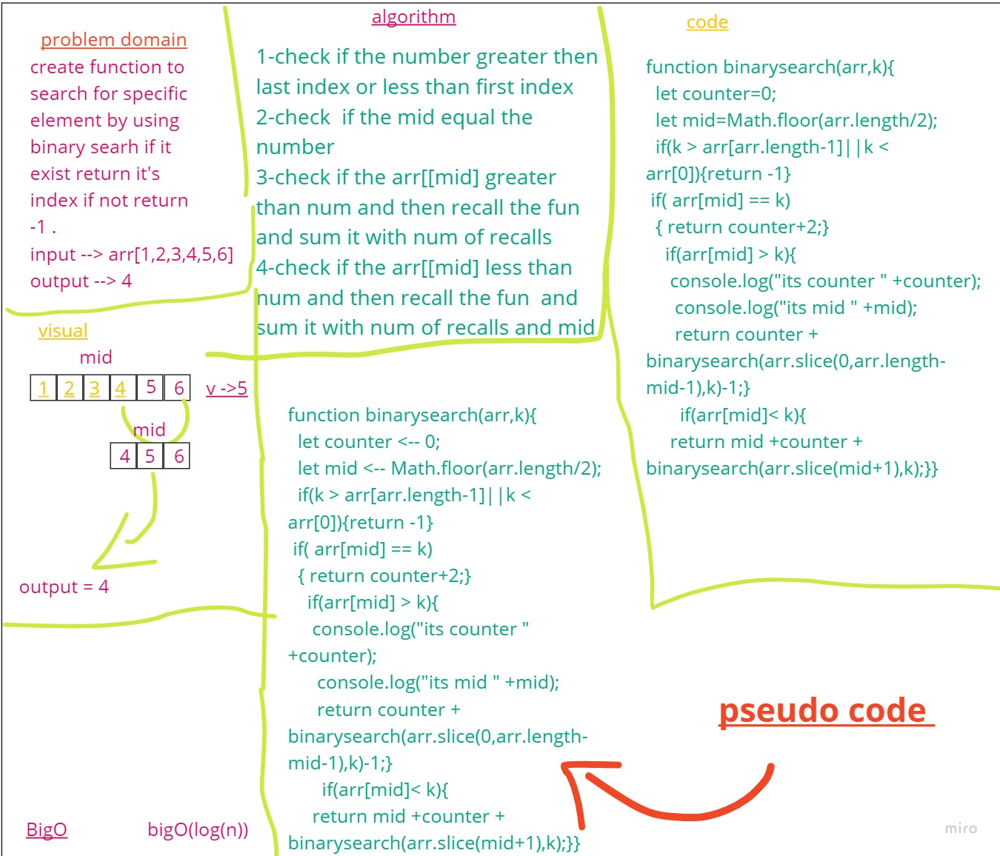

# Binary Search of Sorted Array
<!-- Description of the challenge -->
create function to search for specific element by using binary searh if it exist return it's index if not return -1 .
## Whiteboard Process
<!-- Embedded whiteboard image -->

## Approach & Efficiency
What approach did you take? recursion  
 What is the Big O space/time for this approach? Bigo(log(n))