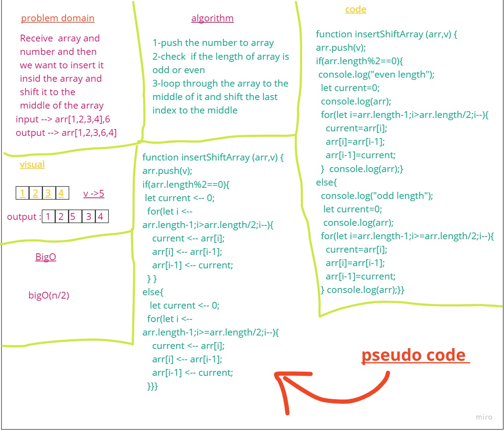

# Insert to Middle of an Array
<!-- Description of the challenge -->
Receive  array and number and then we want to insert it insid the array and shift it to the middle of the array 
## Whiteboard Process
<!-- Embedded whiteboard image -->

## Approach & Efficiency
<!-- What approach did you take? Discuss Why. What is the Big O space/time for this approach? -->
What approach did you take? for loop to loop through the array

Why. What is the Big O space/time for this approach? big O(n/2)