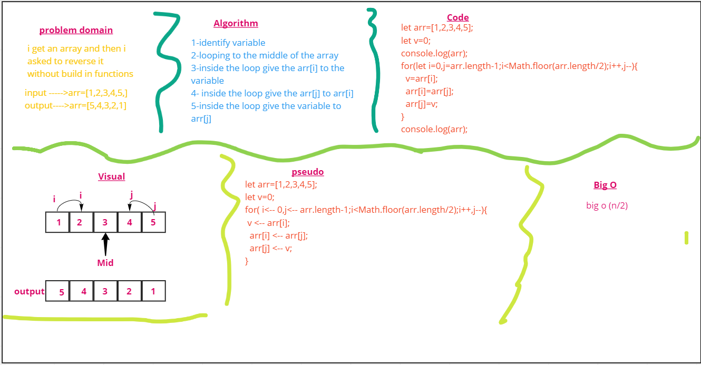

# Reverse an Array
<!-- Description of the challenge -->
get array and return reversed array 
input : arr-->{1,2,3,4,5}
output : arr-->{5,4,3,2,1}

## Whiteboard Process

## Approach & Efficiency
 What approach did you take? for loop to loop through the array 

Why. What is the Big O space/time for this approach? 
big O(n/2)