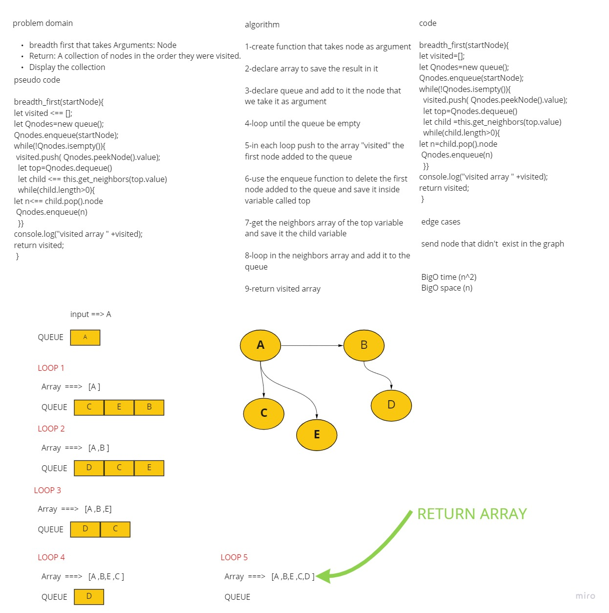

# Challenge Summary
<!-- Description of the challenge -->
breadth first that takes Arguments: Node
Return: A collection of nodes in the order they were visited.
Display the collection
## Whiteboard Process
<!-- Embedded whiteboard image -->

## Approach & Efficiency
<!-- What approach did you take? Why? What is the Big O space/time for this approach? -->
i used wile loop and inside of it i used another  while loop 

BigO time (n^2)
BigO space (n)
## Solution
<!-- Show how to run your code, and examples of it in action -->

```

breadth_first(startNode){
let visited=[];
let Qnodes=new queue();
Qnodes.enqueue(startNode);
while(!Qnodes.isempty()){
  visited.push( Qnodes.peekNode().value);
  let top=Qnodes.dequeue()
  let child =this.get_neighbors(top.value)
  while(child.length>0){
let n=child.pop().node
 Qnodes.enqueue(n)
  }}
console.log("visited array " +visited);
return visited;
 }
