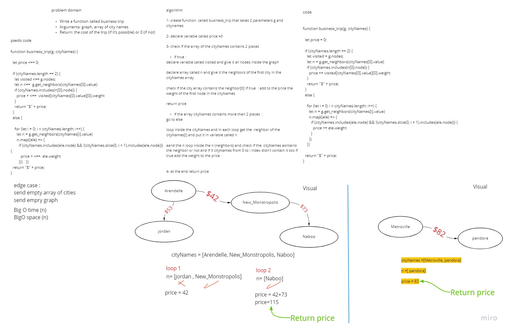

# Challenge Summary
<!-- Description of the challenge -->
Write a function called business trip
Arguments: graph, array of city names
Return: the cost of the trip (if it’s possible) or 0 (if not)
## Whiteboard Process
<!-- Embedded whiteboard image -->

## Approach & Efficiency
<!-- What approach did you take? Why? What is the Big O space/time for this approach? -->
i used if statement and for loop to loop inside the neighbor array and the citynames array 
BigO time (n)
BigO space(n)
## Solution
<!-- Show how to run your code, and examples of it in action -->
```function business_trip(g, cityNames) {

  let price = 0;

  if (cityNames.length == 2) {
    let visited = g.nodes;
    //  console.log(visited[cityNames[0].value][0])
    let n = g.get_neighbors(cityNames[0].value)
    if (cityNames.includes(n[0].node)) {
      price += visited[cityNames[0].value][0].weight
    }
    return "$" + price;
  }
  else {

    for (let i = 0; i < cityNames.length; i++) {
      let n = g.get_neighbors(cityNames[i].value)
      n.map((ele) => {
        if (cityNames.includes(ele.node) && !(cityNames.slice(0, i + 1).includes(ele.node))) {
          //console.log("yes")
          console.log(price + "+" + ele.weight)
          price += ele.weight
          console.log("= " + price)
        }
      })
    }}

  return "$" + price;
}