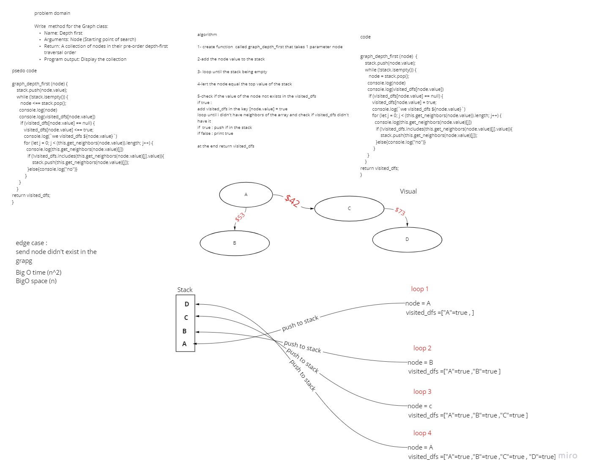

# Depth First Traversal
<!-- Short summary or background information -->
Depth First Traversal (or Search) for a graph is similar to Depth First Traversal of a tree. The only catch here is, unlike trees, graphs may contain cycles (a node may be visited twice). To avoid processing a node more than once, use a boolean visited array. 
## Challenge
<!-- Description of the challenge -->
Write  method for the Graph class:

Name: Depth first
Arguments: Node (Starting point of search)
Return: A collection of nodes in their pre-order depth-first traversal order
Program output: Display the collection

## Whiteboard Process
<!-- Embedded whiteboard image -->

## Approach & Efficiency
<!-- What approach did you take? Why? What is the Big O space/time for this approach? -->
i used while loop and for loop 
BigO time (n^2)
BigO space (n)

## Solution
<!-- Embedded whiteboard image -->
```
 graph_depth_first (node)  { 
    stack.push(node.value);
    while (!stack.isempty()) {
       node = stack.pop();
      console.log(node)
      console.log(visited_dfs[node.value])
       if (visited_dfs[node.value] == null) {
          visited_dfs[node.value] = true;
          console.log(`we visited_dfs ${node.value}`)
          for (let j = 0; j < (this.get_neighbors(node.value)).length; j++) {
            console.log(this.get_neighbors(node.value)[j])
             if (!visited_dfs.includes(this.get_neighbors(node.value)[j].value)){
                 stack.push(this.get_neighbors(node.value)[j]);
             }else{console.log("no")}
           }
      }
    }
}