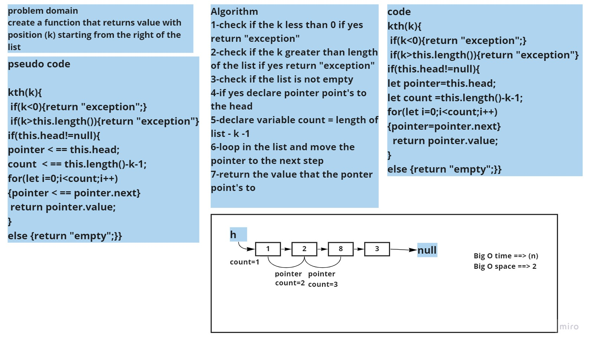

# Challenge Summary
<!-- Description of the challenge -->

create a function that returns value with position (k) starting from the right of the list

## Whiteboard Process
<!-- Embedded whiteboard image -->

## Approach & Efficiency
What approach did you take? while loop (to loop in the list to git the length )
 for loop (to loop in the list until i reach the value that i want)
What is the Big O space/time for this approach? Big O time ==> (n)
Big O space ==> 2 
