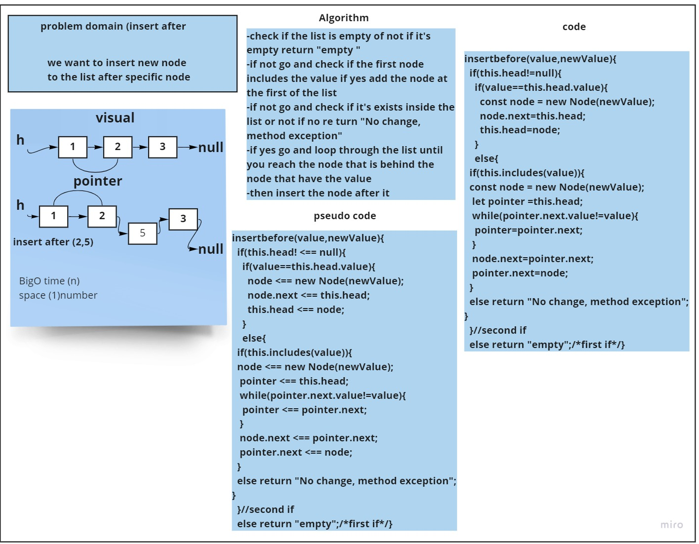

# Challenge Summary
<!-- Description of the challenge -->
we want to create  ( append , insertbefore ,insertafter )
## Whiteboard Process
<!-- Embedded whiteboard image -->
#### append
---

#### insert after
---

#### insert before
---

## Approach & Efficiency
What approach did you take? while loop && if statments 
 Why? i want to loop through linked list nodes and check for the condition 
 What is the Big O space/time for this approach? 
 append ===> Big O(n)
 insertbefore ===>  Big O(n)
 insertafter ===> Big O(n)
scpac for all function (number(1))
## Solution
 Show how to run your code, and examples of it in action 

 
