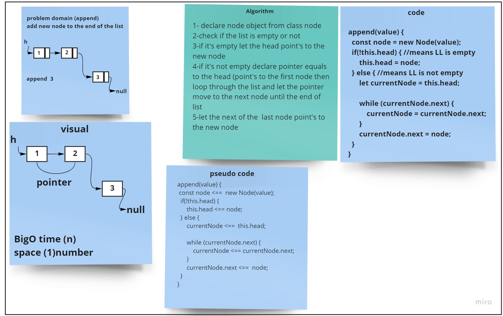
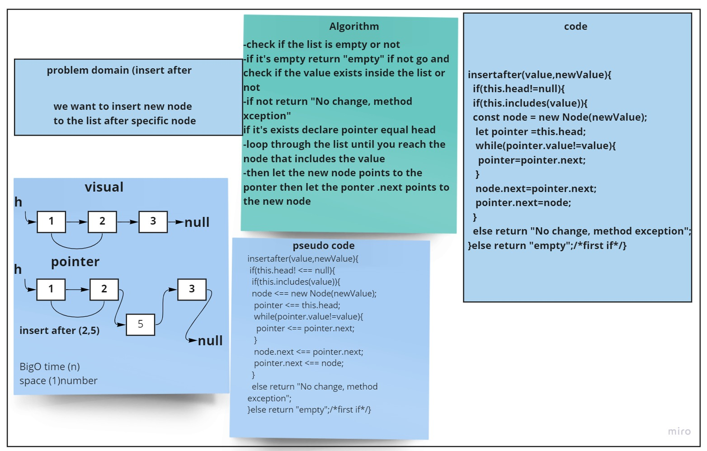

# Challenge Summary
<!-- Description of the challenge -->
we want to create  ( append , insertbefore ,insertafter )
## Whiteboard Process
<!-- Embedded whiteboard image -->
#### append
---

#### insert after
---

#### insert before
---

## Approach & Efficiency
What approach did you take? while loop && if statments 
 Why? i want to loop through linked list nodes and check for the condition 
 What is the Big O space/time for this approach? 
 
 -append ===> add new node at the end of the list  Big O(n) bacause we need to loop in the list until the end and this will take n time and scpace (1)

 -insertbefore ===>add new node before specific node in the list Big O(n) bacause we need to loop in the list until we reach the node that exists behinde specified node and this will take n time and scpace (1)

-insertafter ===>add new node after specific node in the list Big O(n) bacause we need to loop in the list until we reach the node that  specified  and this will take n time and scpace (1)

