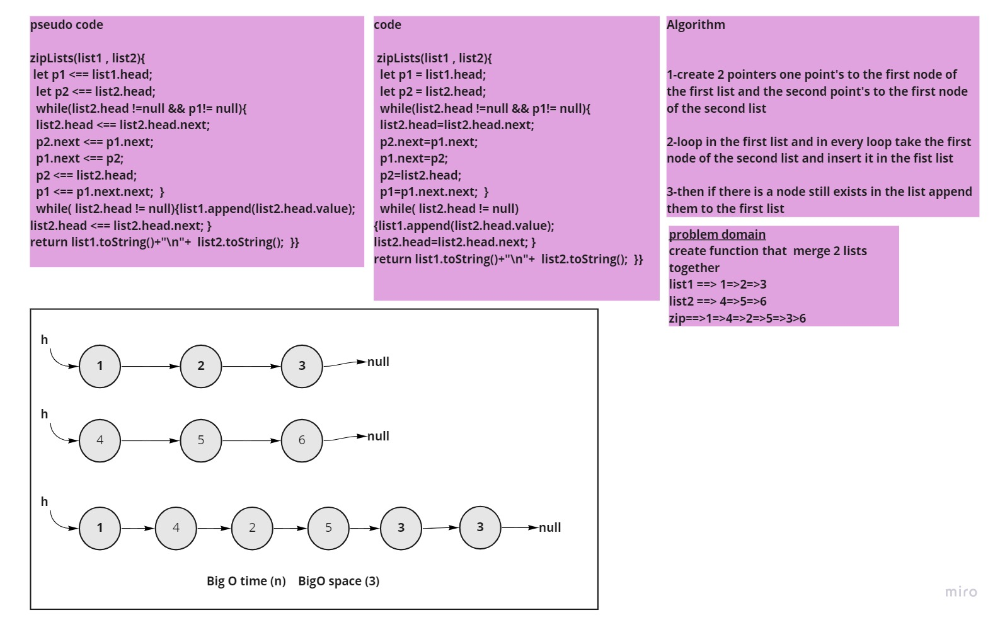

# Challenge Summary
<!-- Description of the challenge -->
create function that  merge 2 lists together  
list1 ==> 1=>2=>3
list2 ==> 4=>5=>6
zip==>1=>4=>2=>5=>3>6
## Whiteboard Process
<!-- Embedded whiteboard image -->

## Approach & Efficiency
What approach did you take? while loop to loop in the list and add nodes 
 What is the Big O space/time for this approach?  BigO time (n)   BigO space (3)
