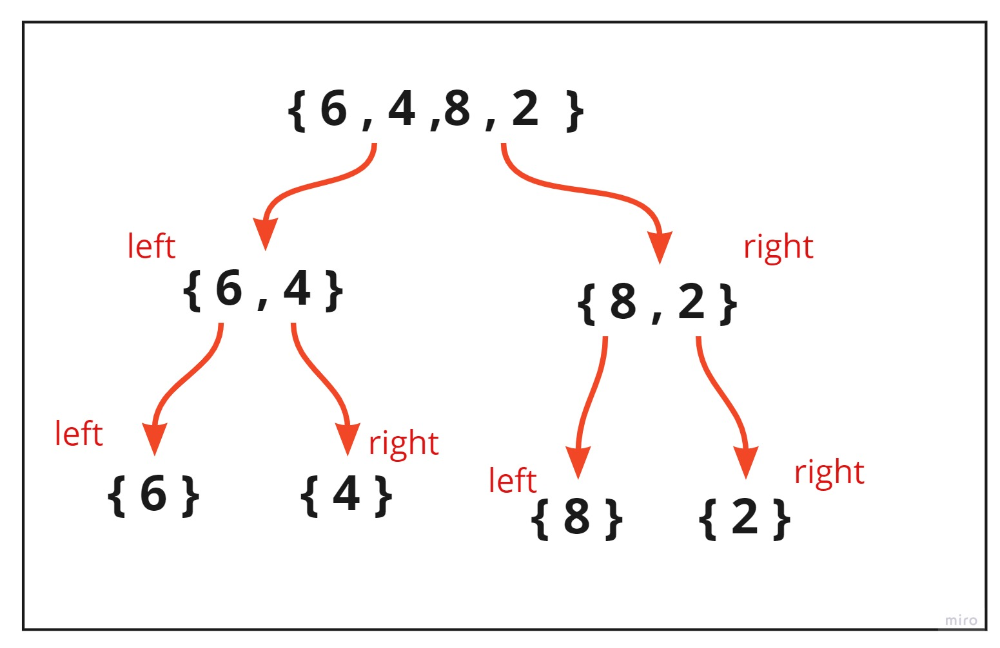
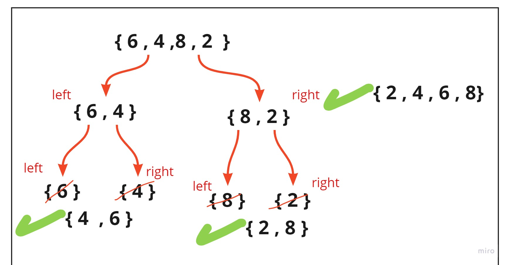

# QuickSort
algorithm follows Divide and Conquer approach. It divides elements into smaller parts based on some condition and performing the sort operations on those divided smaller parts.

Quick Sort algorithm is one of the most used and popular algorithms in any programming language. But, if you are a JavaScript developer, then you might of heard of sort() which is already available in JavaScript. Then, you might have been thinking what the need of this Quick Sort algorithm is. To understand this, first we need what is sorting and what is the default sorting in JavaScript.

# Pseudocode

ALGORITHM QuickSort(arr, left, right)

    if left < right

        // Partition the array by setting the position of the pivot value

        DEFINE position <-- Partition(arr, left, right)

        // Sort the left

        QuickSort(arr, left, position - 1)

        // Sort the right
        QuickSort(arr, position + 1, right)

ALGORITHM Partition(arr, left, right)

    // set a pivot value as a point of reference

    DEFINE pivot <-- arr[right]

    // create a variable to track the largest index of numbers lower than the defined pivot

    DEFINE low <-- left - 1 

    for i <- left to right do

        if arr[i] <= pivot

            low++

            Swap(arr, i, low)

     // place the value of the pivot location in the middle.

     // all numbers smaller than the pivot are on the left, larger on the right.

     Swap(arr, right, low + 1)

    // return the pivot index point

     return low + 1

ALGORITHM Swap(arr, i, low)

    DEFINE temp;

    temp <-- arr[i]

    arr[i] <-- arr[low]

    arr[low] <-- temp

# Trace
Sample Array: [6,4,8,2,]

first of all it will splite the array into 2 peaces (left & right ) until we make each element in single array  as wecansee in the picture : 

step 2:

in the second step we will compare whech one of the arrays (left or right ) is greater than the other and then swap them to put the lowest on the left and the greater on the right and then merge them togother as we can see on the picture : 

Efficency
Best Case Complexity
 - In Quicksort, the best-case occurs when the pivot element is the middle element or near to the middle element. The best-case time complexity of quicksort is O(n*logn).

Average Case Complexity
 - It occurs when the array elements are in jumbled order that is not properly ascending and not properly descending. The average case time complexity of quicksort is O(n*logn).

Worst Case Complexity
 - In quick sort, worst case occurs when the pivot element is either greatest or smallest element. Suppose, if the pivot element is always the last element of the array, the worst case would occur when the given array is sorted already in ascending or descending order. The worst-case time complexity of quicksort is O(n2).

 so in our example it's the  Average Case Complexity it means that it's O(n*logn)