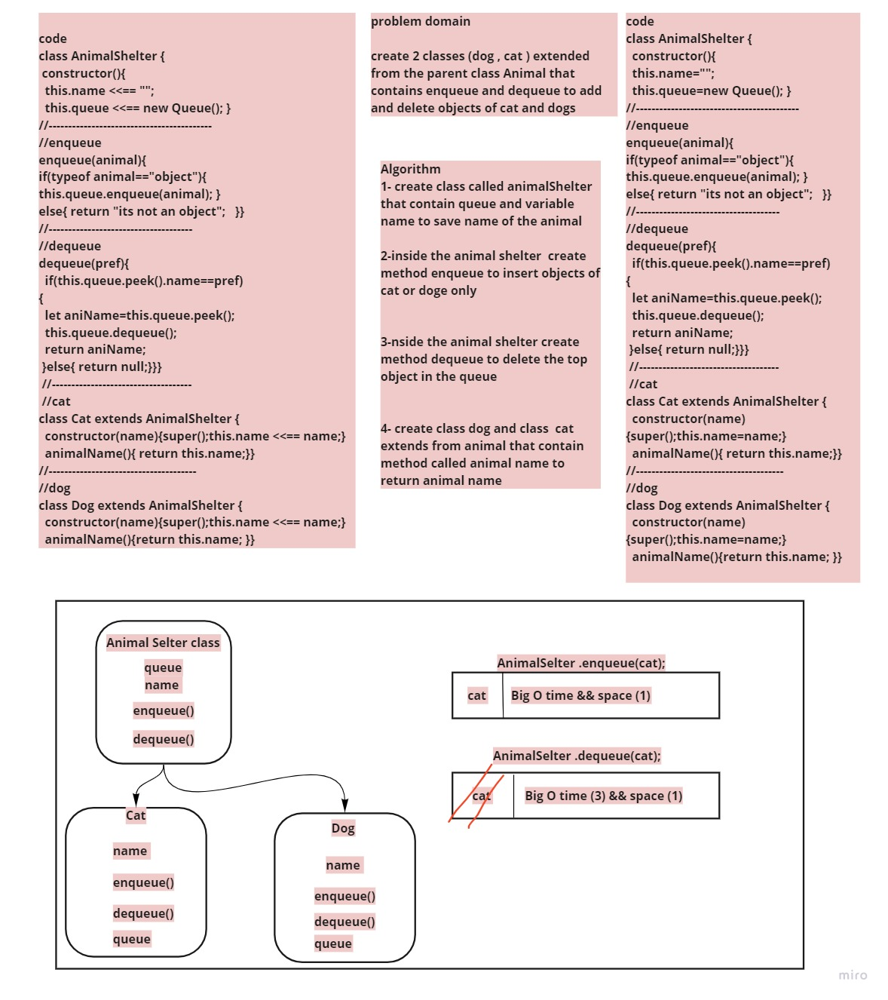

# Challenge Summary
<!-- Description of the challenge -->
create 2 classes (dog , cat ) extended from the parent class Animal that contains enqueue and dequeue to add and delete objects of cat and dogs
## Whiteboard Process
<!-- Embedded whiteboard image -->

## Approach & Efficiency
 What approach did you take? Why? What is the Big O space/time for this approach? 
 enqueue ===> Big O time && space (1)
 dequeue ===> Big O time (3) && space (1)
