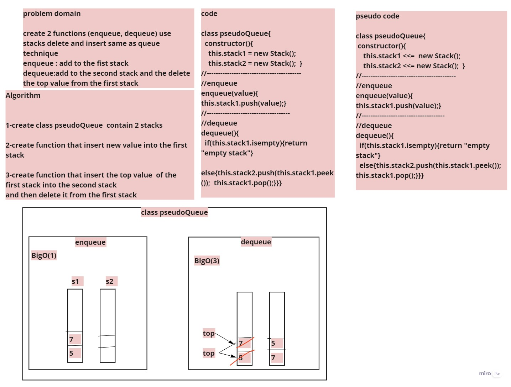

# Challenge Summary
create 2 functions (enqueue, dequeue) use stacks delete and insert same as queue technique
enqueue : add to the fist stack 
dequeue:add to the second stack and the delete the top value from the first stack 
## Whiteboard Process
<!-- Embedded whiteboard image -->

## Approach & Efficiency
 What approach did you take? call stack functions to add and delete BigO(1) for time and 0 for space 

