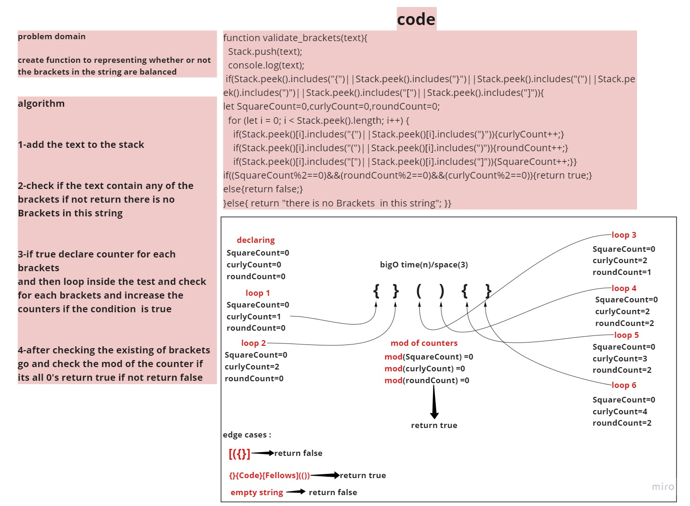

# Challenge Summary
<!-- Description of the challenge -->
create function to representing whether or not the brackets in the string are balanced 
## Whiteboard Process
<!-- Embedded whiteboard image -->

## Approach & Efficiency
 What approach did you take? Why? for loop to loop in the string and count prackets 
 What is the Big O space/time for this approach? bigO time(n)/space(3)
