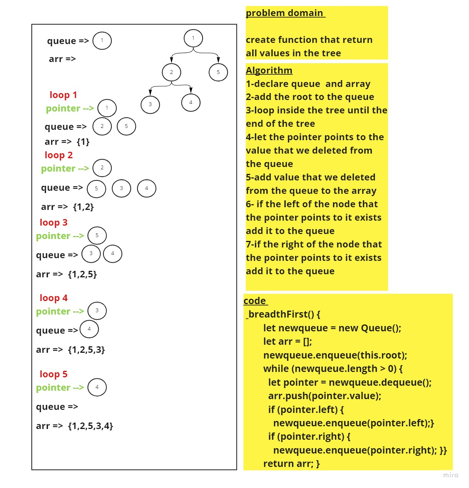

# Challenge Summary
<!-- Description of the challenge -->
create function that return all values in the tree   
## Whiteboard Process
<!-- Embedded whiteboard image -->

## Approach & Efficiency
 What approach did you take?while loop to loop inside the queue  What is the Big O space/time for this approach? BigO time (n) space (n)
