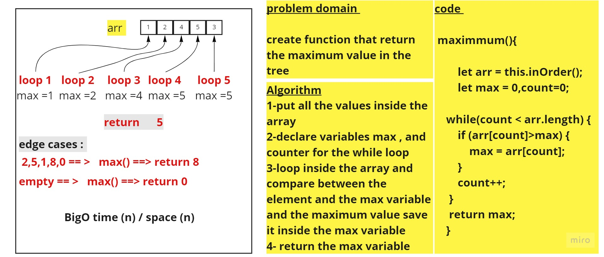

# Trees
<!-- Short summary or background information -->
A tree is also one of the data structures that represent hierarchical data. Suppose we want to show the employees and their positions in the hierarchical form .

## Challenge
<!-- Description of the challenge -->
create a binary tree class contains (preorder , inOrder , postorder )
create 2 functions  ( add , contains) to add new nalues to the tree and check id value exists in the tree or not 

## Whiteboard Process
<!-- Embedded whiteboard image -->
